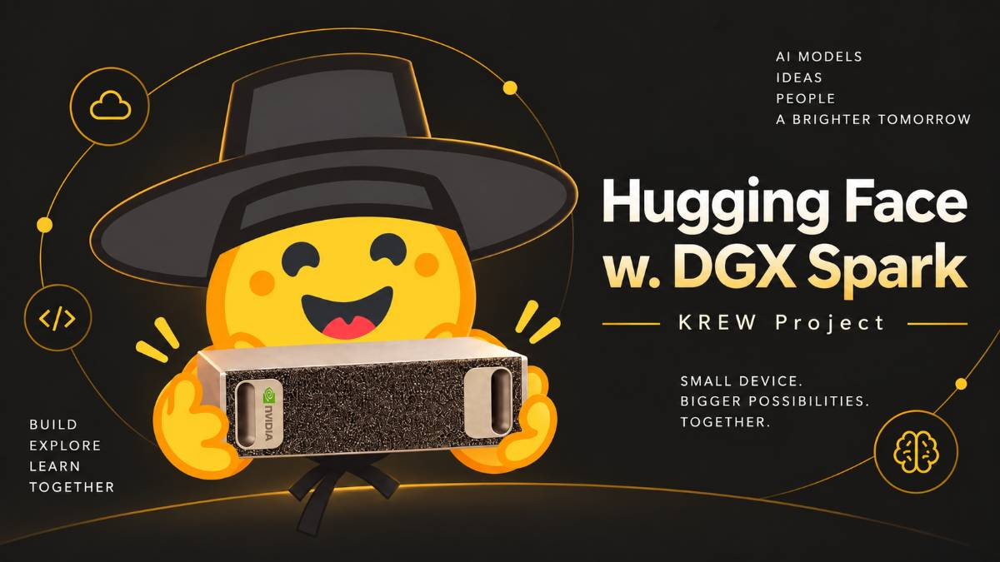

# Hugging Face w. DGX Spark

  

> 내 책상 위의 실험이, 다음 사용자의 시작이 되도록.

가짜연구소(Pseudo Lab) Hugging Face KREW와 함께 NVIDIA DGX Spark에서 Hugging Face 모델을 직접 실행하고, 실제 사용자가 겪는 문제를 재현·개선·검증하는 오픈 프로젝트입니다.

커널을 몰라도 괜찮습니다. 한 사람이 발견한 문제를 팀이 함께 재현하고, 코드·테스트·문서로 해결해 다음 사용자도 같은 문제 앞에서 멈추지 않도록 돕습니다.

## 프로젝트 한눈에 보기

| 항목 | 내용 |
| --- | --- |
| 인원 | 4명 |
| 기간 | 12주 |
| 환경 | 각자의 NVIDIA DGX Spark |
| 방식 | 순환 스터디 → 실제 문제 선정 → 개선 → 독립 검증 → 공개 |
| 목표 | Hugging Face 생태계에 재현 가능한 코드·테스트·문서와 PR 1~3건 기여 |

## 왜 하나요?

새 모델을 실행하면 다음과 같은 질문을 만나게 됩니다.

- 공식 예제가 내 환경에서는 왜 동작하지 않을까요?
- 모델은 실행됐는데 첫 응답이 왜 이렇게 오래 걸릴까요?
- 최적화 옵션을 켜면 실제로 무엇이 달라질까요?

내 환경에서 AI를 실행하려면 설치, 연산 경로, 메모리와 자료형, 버전 호환성, 문제를 설명할 코드와 문서가 모두 필요합니다. 이 프로젝트는 시행착오를 함께 해결하고 기록하여, 한 사람의 실행 경험이 다음 사용자의 시작이 되도록 만드는 것을 목표로 합니다.

## 무엇을 배우고 기여하나요?

작은 예제를 직접 실행하며 다음 주제를 단계적으로 익힙니다.

- 모델 실행의 기초: 모델 로딩, 입력 처리, 출력 생성, CPU·GPU·메모리 흐름
- GPU 커널: 병렬 연산과 PyTorch 연산의 관계, CUDA와 Triton의 역할
- Hugging Face Kernels: Hub·Transformers·Kernels의 연결 구조와 지원 조건
- 성능 측정: 준비 실행, 동기화, 반복 측정, 정확성 비교와 원시 결과 기록
- 오픈소스 기여: 최소 재현 코드, 이슈, 테스트, 문서, PR 작성

기여 방법은 하나가 아닙니다.

- 기존 커널을 모델 실행 경로에 연결하기
- 실행 조건과 버전 호환성 처리하기
- 문제를 재현하는 최소 테스트 만들기
- 사용자가 따라 할 수 있는 한국어 실행 가이드와 영어 기술 설명 작성하기

처음부터 새로운 커널을 만들 필요는 없습니다. 사용자의 불편을 실제로 줄이고 검증할 수 있는 개선이라면 모두 중요한 기여입니다.

## 참여 조건

- 실습과 독립 검증에 사용할 DGX Spark를 최소 1대 확보할 수 있어야 합니다.
- Python 코드를 읽고 예제를 실행할 수 있는 기본 역량을 기대합니다.
- CUDA·Triton·GPU 커널 개발 경험이나 기존 오픈소스 PR 병합 이력은 요구하지 않습니다.
- Linux·Git·PyTorch에서 익숙하지 않은 부분은 함께 실습합니다.
- 정기 모임과 개인 학습·실습을 포함해 주 6~8시간 내외의 꾸준한 참여를 권장합니다.
- 리더를 포함한 모든 참여자가 한 번씩 발표하는 순환 스터디에 참여합니다.
- 질문하고, 실험 조건과 결과를 기록하며, 동료의 작업을 직접 재현하는 태도를 중요하게 생각합니다.

## 12주 진행 계획

### 1단계 · 함께 배우기 (Week 1–5)

- Week 1 · OT: 프로젝트 목표, 12주 운영 방식, DGX Spark 환경, 기본 GPU 예제 확인
- Week 2 · 모델 실행 흐름: 로딩부터 출력까지, CPU·GPU·자료형·메모리 기초
- Week 3 · GPU 커널: PyTorch 연산, CUDA·Triton, 벡터 덧셈 예제
- Week 4 · Hugging Face Kernels: Hub·Transformers·Kernels 관계, 로딩 경로와 지원 조건
- Week 5 · 측정과 재현: 반복 측정, 정확성 비교, 최소 재현 코드와 이슈·PR 기본 구성

### 2단계 · 실제 문제 고르기 (Week 6–7)

- Week 6 · 문제 발굴: 설치·로딩·성능·메모리·실행 조건에서 핵심 과제 1건과 예비 과제 1건 선정
- Week 7 · 원인 분석: 최소 재현 코드, 환경 정보, 기준선, 원인, 기여 대상과 변경 계획 확정

### 3단계 · 개선하고 검증하기 (Week 8–10)

- Week 8 · 첫 기여: 코드·테스트·실행 조건·문서 변경을 작성하고 Draft PR 또는 PR 공개
- Week 9 · 개선 보완: 리뷰 반영, 정확성·경계 조건·회귀 검증, 변경 전후 성능 비교
- Week 10 · 독립 재현: 작성자의 설명 없이 네 대의 장비에서 공개 문서만으로 재실행

### 4단계 · 공개하고 이어가기 (Week 11–12)

- Week 11 · 커뮤니티 공유: 한국어 실행 가이드, 영어 기술 설명, 이슈·PR 상태와 외부 피드백 정리
- Week 12 · 최종 공개: 스터디 자료, 실행 예제, 해결 과정, 검증 결과, 최종 보고서·발표·데모 공개

## 마일스톤과 완료 기준

| 마일스톤 | 핵심 결과 |
| --- | --- |
| M0 · 환경 준비 | 전원 기본 예제 실행, 공통 환경 명세, 저장소, 발표 일정과 협업 규칙 마련 |
| M1 · 순환 스터디 | 전원 발표 1회와 공통 실습 4회, 스터디 자료·실행 예제·질문 기록 공개 |
| M2 · 문제 선정 | 최소 두 대에서 재현되는 핵심 문제, 기준선, 성공 조건, 변경 계획 확보 |
| M3 · 첫 PR | 검토 가능한 PR 제출, 독립 검토, 정확성·지원 조건·성능 변화 검증 |
| M4 · 최종 공개 | 네 대의 검증 기록, 재현 가이드, 최종 보고서·발표·데모, 후속 작업 담당자 확정 |

## 실험 기록 원칙

모든 실험은 다음 정보를 남기는 것을 기본으로 합니다.

- 하드웨어와 드라이버, CUDA·Python·PyTorch·Transformers·Kernels 버전
- 실행 명령과 모델·커널 리비전
- 입력 크기, 자료형, 배치 등 비교 조건
- 변경 전 기준선과 변경 후 결과
- 정확성 비교 방법과 성능 측정의 원시 결과
- 성공·실패 조건, 알려진 제한 사항, 재현에 필요한 추가 설정

성능 개선을 주장할 때는 동일한 조건에서 측정한 변경 전후 결과와 원시 데이터를 함께 공개합니다. PR 병합은 외부 검토 일정에 영향을 받을 수 있으므로, 제출과 검증을 핵심 완료 조건으로 두고 상태를 명확히 기록합니다.

## 이 저장소의 구성

진행에 따라 다음 자료를 추가합니다.

- 스터디 발표 자료와 학습 노트
- DGX Spark에서 실행하는 최소 예제
- 문제 재현 코드와 기준선 측정 결과
- 해결 과정과 변경 전후 검증 기록
- 한국어 실행 가이드와 영어 기술 설명
- 관련 이슈·PR 및 후속 작업 상태표

프로젝트 초기에는 자료 구조와 공통 실행 환경을 먼저 정리합니다. 재현 가능한 결과를 우선하며, 실행 조건이나 지원 범위가 달라질 수 있는 내용은 버전과 제한 사항을 함께 기록합니다.

## 참고 링크

- [Pseudo Lab 프로젝트 페이지](https://pseudo-lab.com/projects/f03054f6-421a-4a5b-ba51-9b9e34054604)
- [Hugging Face](https://huggingface.co/)
- [Hugging Face Transformers](https://github.com/huggingface/transformers)
- [Hugging Face Kernels](https://github.com/huggingface/kernels)

## 라이선스

라이선스는 프로젝트에서 다루는 원본 프로젝트와 기여 대상의 라이선스를 확인한 뒤 별도로 정합니다. 각 예제와 변경 사항에는 적용되는 라이선스와 출처를 명시합니다.
